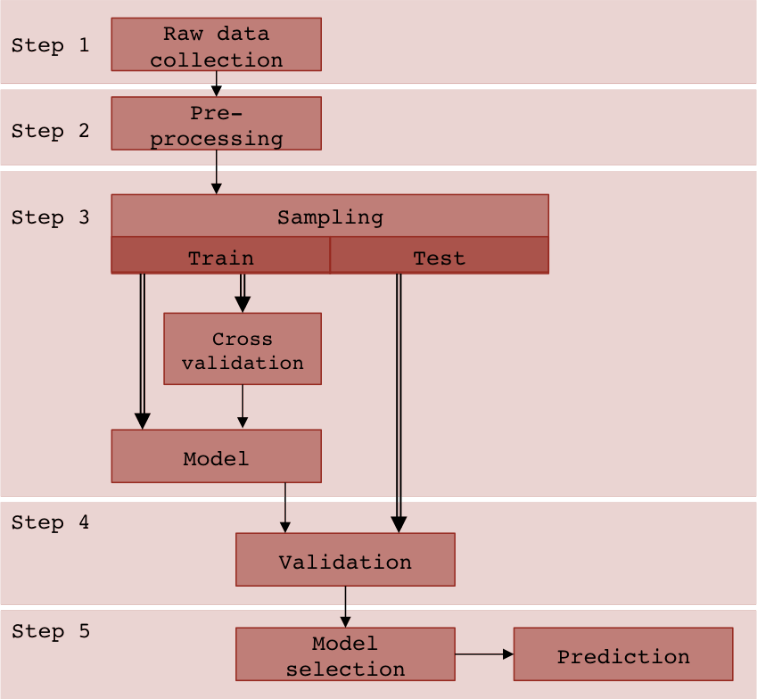

# Mozilla-and-Eclipse-Defect-Tracking

This project was part of a seminar on Business Analytics in the fall semester 2015 at the University of Zurich instructed by [Prof. Harry Paarsch](https://sites.google.com/site/hjpaarsch/). The work was done in collaboration with *Luca Gageauf*.

## Dataset:
[Eclipse and Mozilla Defect Tracking Dataset](https://github.com/ansymo/msr2013-bug_dataset): "a dataset with over 200.000 reported bugs extracted from the Eclipse and Mozilla projects"

## Goal and motivation
- identify the factors which are likely to be predictive of a bug being fixed
- Save labor time and thus increase productivity.

## Approach:
- After reading [Lamkanfi, Perez and Demeyer (2013)](https://ieeexplore.ieee.org/document/6624028/), we had a look at examples of bug reports and their attributes.
- We compared the number of ocurrences of a few bug reports in each CSV table in order to grasp the process through which the vug has to go through during its lifetime. 
- We ran a logistic regression for every attribute to have a sense of their relative importance and decided on attributes to focus on (cf. ExploratoryLogit.r)
- We created extra prediction variables to increase the accuracy of our model and then sampled, validated and finally selected a model for prediction.

## Files contained in project folder:
- [Read.py](Read.py) : a file written in Python importing and cleaning the data
- [ExploratoryRead.py](ExploratoryRead.py) and [ExploratoryLogit.r](ExploratoryLogit.r) : files written respectively in Python and R which explores the structure of the data
- [PredBugFixes.r](PredBugFixes.r) : a file written in R in which we tested the best predictive models based on our exploratory analysis
- [Presentation.pdf](Presentation.pdf) : a PDF presentation to explain our work for the professor

